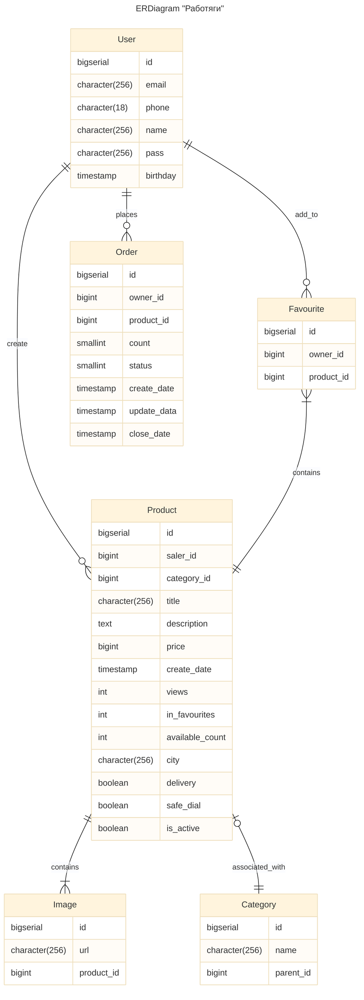

# Таблицы
## Product
Таблица с полями объявления

|   Название                            |   Тип            |
|:--------------------------------------|:-----------------|
|  $\underline{\text{id}}$              |  bigserial       |
|  saler_id                             |  bigint          |
|  category_id                          |  bigint          |
|  title                                |  character(256)  |
|  description                          |  text            |
|  price                                |  bigint          |
|  creation_date                        |  timestamp       |
|  views                                |  int             |
|  in_favourites                        |  int             |
|  available_count                      |  int             |
|  city                                 |  char[256]       |
|  delivery                             |  boolean         |
|  safe_dial                            |  boolean         |
| is_active                             | boolean          |  

### ФЗ
{ id } $\rightarrow$ saler_id, category_id, title, description, price, creation_date, views, in_favourites, available_count, city, delivery, safe_dial
### Нормальные формы
1. все типы атрибутов атомарны $\Rightarrow$ отношение находится в 1НФ.
2. отношение находится в 1НФ, ключ является не составным $\Rightarrow$ не имеем зависимости неключевых атрибутов от части ключа $\Rightarrow$ отношение находится в 2НФ.
3. отношение находится в 2НФ и мы не имеем транзитивных ФЗ неключевых атрибутов от ключевых $\Rightarrow$ отношение находится в 3НФ.
4. отношение находится в 3НФ и мы не имеем составного ключа $\Rightarrow$ отношение находится в НФБК.
### Ограничения
id primary key
saler_id foreign key

## User
Таблица с данными пользователя

| Название                | Тип            |
|:------------------------|:---------------|
| $\underline{\text{id}}$ | bigserial      |
| email                   | character(256) |
| phone                   | character(18)  |
| name                    | character(256) |
| pass                    | character(256) |
| birthday                | timestamp      |  

### ФЗ
{ id } $\rightarrow$ email, phone, name, pass, birthday
### Нормальные формы
1. все типы атрибутов атомарны $\Rightarrow$ отношение находится в 1НФ.
2. отношение находится в 1НФ, ключ является не составным $\Rightarrow$ не имеем зависимости неключевых атрибутов от части ключа $\Rightarrow$ отношение находится в 2НФ.
3. отношение находится в 2НФ и мы не имеем транзитивных ФЗ неключевых атрибутов от ключевых $\Rightarrow$ отношение находится в 3НФ.
4. отношение находится в 3НФ и мы не имеем составного ключа $\Rightarrow$ отношение находится в НФБК.

## Order
Таблица с данными заказа. Отражает данные заказа на покупку

|Название|Тип|
|---|---|
|$\underline{\text{id}}$|bigserial|
|owner_id|bigint|
|product_id|bigint|
|count|smallint|
|status|smallint|
|create_date|timestamp|
|update_date|timestamp|
|close_date|timestamp|

### ФЗ
{ id } $\rightarrow$ owner_id, product_id, count, status, creation_data, update_data, closed_data
### Нормальные формы
1. все типы атрибутов атомарны $\Rightarrow$ отношение находится в 1НФ.
2. отношение находится в 1НФ, ключ является не составным $\Rightarrow$ не имеем зависимости неключевых атрибутов от части ключа $\Rightarrow$ отношение находится в 2НФ.
3. отношение находится в 2НФ и мы не имеем транзитивных ФЗ неключевых атрибутов от ключевых $\Rightarrow$ отношение находится в 3НФ.
4. отношение находится в 3НФ и мы не имеем составного ключа $\Rightarrow$ отношение находится в НФБК.
## Image
Таблица с путями до изображения на файловом сервере

| Название                | Тип            |
|:------------------------|:---------------|
| $\underline{\text{id}}$ | bigserial      |
| url                     | character(256) |
| product_id              | bigint         |  

### ФЗ
{ id } $\rightarrow$ url, product_id
### Нормальные формы
1. все типы атрибутов атомарны $\Rightarrow$ отношение находится в 1НФ.
2. отношение находится в 1НФ, ключ является не составным $\Rightarrow$ не имеем зависимости неключевых атрибутов от части ключа $\Rightarrow$ отношение находится в 2НФ.
3. отношение находится в 2НФ и мы не имеем транзитивных ФЗ неключевых атрибутов от ключевых $\Rightarrow$ отношение находится в 3НФ.
4. отношение находится в 3НФ и мы не имеем составного ключа $\Rightarrow$ отношение находится в НФБК.
## Category
Таблица с категориями

| Название                | Тип            |
|:------------------------|:---------------|
| $\underline{\text{id}}$ | bigserial      |
| name                    | character(256) |
| parent_id               | bigint         |  

### ФЗ
{ id } $\rightarrow$ name, parent_id
### Нормальные формы
1. все типы атрибутов атомарны $\Rightarrow$ отношение находится в 1НФ.
2. отношение находится в 1НФ, ключ является не составным $\Rightarrow$ не имеем зависимости неключевых атрибутов от части ключа $\Rightarrow$ отношение находится в 2НФ.
3. отношение находится в 2НФ и мы не имеем транзитивных ФЗ неключевых атрибутов от ключевых $\Rightarrow$ отношение находится в 3НФ.
4. отношение находится в 3НФ и мы не имеем составного ключа $\Rightarrow$ отношение находится в НФБК.
## Favourite
Сводная таблица User $\rightarrow$ Product, отражающая список избранного

|Название|Тип|
|---|---|
|$\underline{\text{id}}$|bigserial|
|owner_id|bigint|
|product_id|bigint|

### ФЗ
{ id } $\rightarrow$ product_id, owner_id
### Нормальные формы
1. все типы атрибутов атомарны $\Rightarrow$ отношение находится в 1НФ.
2. отношение находится в 1НФ, ключ является не составным $\Rightarrow$ не имеем зависимости неключевых атрибутов от части ключа $\Rightarrow$ отношение находится в 2НФ.
3. отношение находится в 2НФ и мы не имеем транзитивных ФЗ неключевых атрибутов от ключевых $\Rightarrow$ отношение находится в 3НФ.
4. отношение находится в 3НФ и мы не имеем составного ключа $\Rightarrow$ отношение находится в НФБК.
***
# ERDiagram
Код **mermaid** диаграммы представлен ниже. [Визуализация в вебе](https://www.mermaidchart.com/raw/bb85db47-1f82-454d-920a-3b15c2000041?version=v0.1&theme=dark&format=svg)

