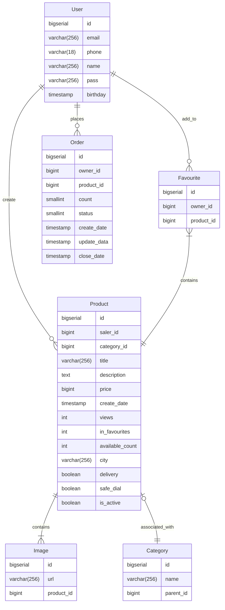

# Таблицы

## Product

Таблица с полями объявления

|   Название              |   Тип            | Описание                                               |
|:------------------------|:-----------------|:-------------------------------------------------------|
|   <u>id</u>             |   bigserial      | Синтетический ключ                                     |
|   saler_id              |   bigint         | внешний ключ к пользователю, который создал объявление |
|   category_id           |   bigint         | внешний ключ к категории объявления                    |
|   title                 |   varchar(256)   | Краткое описание                                       |
|   description           |   text           | Полное описание                                        |
|   price                 |   bigint         | Цена                                                   |
|   created_at            |   timestamp      | Время создания объявления                              |
|   views                 |   int            | Кол-во просмотров                                      |
|   available_count       |   int            | Кол-во товара, доступного для продажи                  |
|   city                  |   varchar(256)   | Город, в котором товар находится                       |
|   delivery              |   boolean        | Доступна ли доставка                                   |
|   safe_deal             |   boolean        | Доступна ли опция безопасной сделки                    |
|   is_active             |   boolean        | Активно ли ообъявление                                 |  

### ФЗ

{ id } -> saler_id, category_id, title, description, price, creation_date, views, in_favourites, available_count, city,
delivery, safe_dial

### Нормальные формы

1. Все типы атрибутов атомарны => отношение находится в 1НФ.
2. Отношение находится в 1НФ, ключ является не составным => не имеем зависимости неключевых атрибутов от части ключа =>
   отношение находится в 2НФ.
3. Отношение находится в 2НФ и мы не имеем транзитивных ФЗ неключевых атрибутов от ключевых => отношение находится в
   3НФ.
   Или любой столбец зависит только от ключевых столбцов => отношение в 3НФ.
4. Требование НФБК - атрибуты составного ключа не должны зависеть от неключевых атрибутов.
   Тогда т.к. отношение находится в 3НФ и мы не имеем составного ключа => отношение находится в НФБК.

### Ограничения

Все ограничения можно посмотреть в [файле](../migrations/000001_create_full.up.sql)  

Здесь только пояснения к некоторым:

* CONSTRAINT not_zero_count_with_active CHECK (not (available_count = 0 and is_active)). Проверяем что
  заказ не может быть активным при нулевом количестве доступных товаров.
* CONSTRAINT max_len_description CHECK (LENGTH(description) <= 4000). Проверка максимальной длинны описания объявления
* Тут и далее используется тип varchar, а не char, т.к. по производительности в
  postgres они одинаковые, но в char доп память тратиться на дополнение пробелами.

## User

Таблица с данными пользователя

|  Название   |  Тип           | Описание                    |
|:------------|:---------------|:----------------------------|
|  <u>id</u>  |  bigserial     | Синтетический ключ          |
|  email      |  varchar(256)  | Почта                       |
|  phone      |  varchar(18)   | Телефон                     |
|  name       |  varchar(256)  | ФИО юзера либо никнейм      |
|  password       |  varchar(256)  | Пароль в зашифрованном виде |
|  birthday   |  timestamp     | Дата дня рождения           |  

### ФЗ

{ id } -> email, phone, name, pass, birthday

{ email } -> id, phone, name, pass, birthday

{ phone } -> id, email, name, pass, birthday

### Нормальные формы

1. Все типы атрибутов атомарны => отношение находится в 1НФ.
2. Отношение находится в 1НФ, ключ является не составным => не имеем зависимости неключевых атрибутов от
   части ключа => отношение находится в 2НФ.
3. Отношение находится в 2НФ и мы не имеем транзитивных ФЗ неключевых атрибутов от ключевых => отношение
   находится в 3НФ. Или любой столбец зависит только от ключевых столбцов => отношение в 3НФ.
4. Требование НФБК - атрибуты составного ключа не должны зависеть от неключевых атрибутов.
   Тогда т.к. отношение находится в 3НФ и мы не имеем составного ключа => отношение находится в НФБК.

## Order

Таблица с данными заказа. Отражает данные заказа на покупку

|  Название         |  Тип        | Описание                                             |
|:------------------|:------------|:-----------------------------------------------------|
|  <u>id</u>        |  bigserial  | Синтетический ключ                                   |
|  owner_id         |  bigint     | Внешний ключ к пользователю, который создал заказ    |
|  product_id       |  bigint     | Внешний ключ к объявлению, на которое заказ размещен |
|  count            |  smallint   | Кол-во покупаемого товара                            |
|  status           |  smallint   | Статус заказа                                        |
|  created_at       |  timestamp  | Дата создания заказа                                 |
|  updated_at       |  timestamp  | Дата последнего&nbsp;обновления заказа               |
|  closed_at        |  timestamp  | Дата закрытия заказа                                 |  

### ФЗ

{ id } -> owner_id, product_id, count, status, creation_data, update_data, closed_data

### Нормальные формы

1. Все типы атрибутов атомарны => отношение находится в 1НФ.
2. Отношение находится в 1НФ, ключ является не составным => не имеем зависимости неключевых атрибутов от
   части ключа => отношение находится в 2НФ.
3. Отношение находится в 2НФ и мы не имеем транзитивных ФЗ неключевых атрибутов от ключевых $\Rightarrow$ отношение
   находится в 3НФ.
   Или любой столбец зависит только от ключевых столбцов => отношение в 3НФ.
4. Требование НФБК - атрибуты составного ключа не должны зависеть от неключевых атрибутов.
   Тогда т.к. отношение находится в 3НФ и мы не имеем составного ключа => отношение находится в НФБК.

### Ограничения

Все ограничения можно посмотреть в Все ограничения можно посмотреть в [файле](../migrations/000001_create_full.up.sql)  

Здесь только пояснения к некоторым:
* CONSTRAINT status_contract CHECK ( status BETWEEN 0 AND 3). Аналогия на enum,
но т.к. нельзя составные типы, то проверяем, что значение находится в
обговоренном диапазоне.

## Image

Таблица с путями до изображения на файловом сервере

|  Название        |  Тип           | Описание                                                   |
|:-----------------|:---------------|:-----------------------------------------------------------|
|  <u>id</u>       |  bigserial     | Синтетический ключ                                         |
|  url             |  varchar(256)  | Путь к файлу                                               |
|  product_id      |  bigint        | Внешний ключ к объявлению, к которому добавили изображение |  

### ФЗ

{ id } -> url, product_id

### Нормальные формы

1. Все типы атрибутов атомарны => отношение находится в 1НФ.
2. Отношение находится в 1НФ, ключ является не составным => не имеем зависимости неключевых атрибутов от
   части ключа => отношение находится в 2НФ.
3. Отношение находится в 2НФ и мы не имеем транзитивных ФЗ неключевых атрибутов от ключевых => отношение
   находится в 3НФ. Или любой столбец зависит только от ключевых столбцов => отношение в 3НФ.
4. Требование НФБК - атрибуты составного ключа не должны зависеть от неключевых атрибутов.
   Тогда т.к. отношение находится в 3НФ и мы не имеем составного ключа => отношение находится в НФБК.
## Category

Таблица с категориями

|  Название       |  Тип           | Описание                      |
|:----------------|:---------------|:------------------------------|
|  <u>id</u>      |  bigserial     | Синтетический ключ            |
|  name           |  varchar(256)  | Имя категории                 |
|  parent_id      |  bigint        | Индекс родительской категории |  

### ФЗ

{ id } -> name, parent_id
{ name } -> id, parent_id

### Нормальные формы

1. Все типы атрибутов атомарны => отношение находится в 1НФ.
2. Отношение находится в 1НФ, ключ является не составным => не имеем зависимости неключевых атрибутов от
   части ключа => отношение находится в 2НФ.
3. Отношение находится в 2НФ и мы не имеем транзитивных ФЗ неключевых атрибутов от ключевых => отношение
   находится в 3НФ. Или любой столбец зависит только от ключевых столбцов => отношение в 3НФ.
4. Требование НФБК - атрибуты составного ключа не должны зависеть от неключевых атрибутов.
   Тогда т.к. отношение находится в 3НФ и мы не имеем составного ключа => отношение находится в НФБК.

## Favourite

Сводная таблица User -> Product, отражающая список избранного

|  Название        |  Тип        | Описание                                                            |
|:-----------------|:------------|:--------------------------------------------------------------------|
|  <u>id</u>       |  bigserial  | Синтетический ключ                                                  |
|  owner_id        |  bigint     | Внешний ключ к пользователю, который добавил объявление в избранное |
|  product_id      |  bigint     | Внешний ключ к объявлению, которое пользователь добавил в избранное |  

### ФЗ

{ id } -> product_id, owner_id

### Нормальные формы

1. Все типы атрибутов атомарны => отношение находится в 1НФ.
2. Отношение находится в 1НФ, ключ является не составным => не имеем зависимости неключевых атрибутов от
   части ключа => отношение находится в 2НФ.
3. Отношение находится в 2НФ и мы не имеем транзитивных ФЗ неключевых атрибутов от ключевых => отношение
   находится в 3НФ. Или любой столбец зависит только от ключевых столбцов => отношение в 3НФ.
4. Требование НФБК - атрибуты составного ключа не должны зависеть от неключевых атрибутов.
Тогда т.к. отношение находится в 3НФ и мы не имеем составного ключа => отношение находится в НФБК.

***

# ERDiagram

Код **mermaid** диаграммы представлен
ниже. [Визуализация в вебе](https://www.mermaidchart.com/raw/8bdbfa77-0510-4967-8b91-692e472fc415?version=v0.1&theme=light&format=svg)

